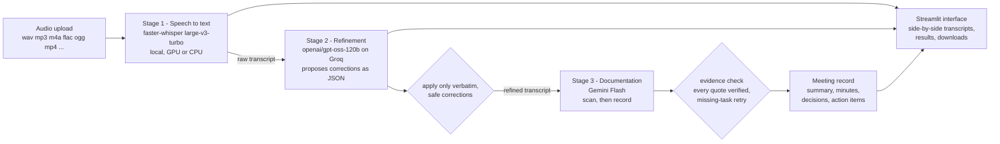

# AI Meeting Assistant

Upload a meeting recording and get back a raw transcript, a domain-corrected transcript, a short
summary, organised minutes, key decisions and action items. Built for the Inter IIT Tech Meet 15.0
Bootcamp (Phase 2, ML problem statement).

Three models run as three separate stages, in order:



| Stage | Model | Role |
|-------|-------|------|
| 1. Speech to text | `faster-whisper` **large-v3-turbo** (runs on your machine; CUDA float16 on an NVIDIA GPU, automatic CPU fallback to `small.en` int8) | Transcribe the uploaded recording |
| 2. Refinement | **`openai/gpt-oss-120b`** served by Groq | Propose corrections for misrecognised technical terms, acronyms and names; Python applies the safe ones |
| 3. Documentation | **Gemini Flash** through the Gemini API (default `gemini-3.1-flash-lite`, configurable) | Produce summary, minutes, key decisions and action items from the *refined* transcript |

`openai/gpt-oss-120b` was the Stage 2 model from the start of development and for every sample output
in this repository. The model IDs are plain settings (`GROQ_MODEL`, `GEMINI_MODEL`), not hard-wired.

## What it guarantees

* **Refinement cannot rewrite the meeting.** The model never outputs a transcript. It lists corrections
  (exact context snippet, wrong words, replacement, reason, supporting quote) and `refine.py`
  applies each one only at its quoted context. A day, number or date may change only to a value that is
  mentioned elsewhere in the transcript, and corrections that would change a negation, hedge or
  commitment word are refused. Everything not listed stays byte-for-byte identical. Refused corrections
  are shown in the interface with the reason.
* **Nothing is invented.** The prompt requires `owner` and `deadline` to be the literal string
  `unspecified` unless the transcript states them, and an `unassigned` task never keeps an owner. Every decision and action item carries
  supporting quotes, and the code checks that each quote really appears in the refined transcript
  (items whose quotes cannot be found are flagged "evidence not verified"; items with no quote at all
  are dropped).
* **No missing tasks.** The model first writes a `commitment_scan` of every promise, request and
  decision in the transcript. If the scan finds more tasks than the model then lists, the call is
  repeated once with feedback, and any remaining gap is shown as a warning.
* **Proposals are not decisions.** The extraction prompt only records a decision when the meeting
  agreed on it (rejected proposals are recorded as negative decisions), and each action item has a status:
  `confirmed`, `conditional` (with the condition kept) or `unassigned`.
* **Both record formats agree.** The Markdown and JSON downloads are produced from the same validated
  object. Empty lists are shown as "none" rather than filled in.
* **Clear errors.** Unsupported, empty, oversized, undecodable or silent files, a missing ffmpeg, GPU
  problems, missing or rejected API keys, rate limits and network failures each produce a specific
  message that names the stage and what to do. If a later stage fails, the raw transcript stays visible
  and downloadable.

## Setup

You need Python 3.10-3.12, [ffmpeg](https://ffmpeg.org/) on your PATH, and two free API keys:

* Groq: <https://console.groq.com/keys>
* Gemini: <https://aistudio.google.com/apikey>

**Windows (PowerShell, from the project folder)**

```powershell
powershell -ExecutionPolicy Bypass -File .\setup.ps1
```

**Linux / macOS**

```bash
bash setup.sh
```

The scripts create a virtual environment (Windows: `%LOCALAPPDATA%\meeting-assistant\venv`; Linux/macOS:
`.venv`), install `requirements.txt`, check ffmpeg, create `.env` from `.env.example`, run the tests and
check the speech model. Open `.env` and fill in the two keys:

```
GROQ_API_KEY=your_groq_key
GEMINI_API_KEY=your_gemini_key
```

Keys are read only from `.env` (or the environment), are never shown in the interface and never written
to the downloads.

**Manual install** (any OS): `python -m venv .venv`, activate it, `pip install -r requirements.txt`,
copy `.env.example` to `.env`.

### GPU or CPU

* With an NVIDIA GPU and driver, Stage 1 uses `large-v3-turbo` on CUDA (float16). The model (~1.5 GB) is
  downloaded on first use. CTranslate2 needs the CUDA 12 cuBLAS and cuDNN 9 libraries; if they are not
  installed system-wide, run `pip install nvidia-cublas-cu12 "nvidia-cudnn-cu12==9.*"` (about 750 MB).
  The app registers those DLLs automatically on Windows.
* Without a usable GPU (or if CUDA fails at load time or mid-transcription) it falls back to `small.en`
  on CPU with int8, shows a warning, and carries on. Force this with `WHISPER_DEVICE=cpu` in `.env`.
  CPU transcription is slower and less accurate than the GPU model.

## Run

```
streamlit run app.py
```

(On Windows use the venv's Python: `& "$env:LOCALAPPDATA\meeting-assistant\venv\Scripts\python.exe" -m streamlit run app.py`.)

1. Upload a recording (wav, mp3, m4a, flac, ogg, opus, aac, mp4, webm; up to 500 MB).
2. Press **Process recording**. Three status lines show the progress of each stage.
3. The results appear under a row of key numbers (audio length, speech model, corrections, decisions,
   action items) and six tabs:
   * **Transcripts**: raw and refined side by side (tick "Highlight what refinement changed"), the list of
     corrections that were applied or refused, and the raw transcript with timestamps.
   * **Summary** and **Minutes**.
   * **Key decisions**: one card per decision.
   * **Action items**: one card per task with its status (confirmed, conditional, unassigned), owner and
     deadline (`unspecified` when not stated), plus a sortable table view.
   * **Downloads**: raw transcript (.txt), refined transcript (.txt), meeting record (.md) and (.json).
4. "Why this?" on any decision or task opens the supporting quotes; the sidebar toggle "Show evidence" opens
   all of them. Run notices (for example a GPU fallback) are grouped under "notice(s) about this run".

### Command line

```
python scripts/run_sample.py path/to/meeting.mp3
```

runs the identical pipeline and writes the four output files to `samples/<name>/`. Each stage can also
be run alone: `python -m pipeline.stt file.mp3`, `python -m pipeline.refine transcript.txt`,
`python -m pipeline.document refined.txt`.

## Outputs

| Output | Where |
|--------|-------|
| Raw transcript | shown in the app, `raw_transcript.txt` |
| Refined transcript | shown in the app, `refined_transcript.txt` |
| Meeting minutes (summary + sections) | app, `meeting_record.md` / `.json` |
| Key decisions (empty list if none) | app, `meeting_record.md` / `.json` |
| Action items (task, owner, deadline; `unspecified` when not stated) | app, `meeting_record.md` / `.json` |

The JSON file also contains run metadata (models used, duration, warnings). A sample recording with all
generated outputs is in [`samples/`](samples/).

## Configuration

Everything has a default in `pipeline/config.py`; override with environment variables or `.env`:
`WHISPER_DEVICE`, `WHISPER_MODEL`, `GROQ_MODEL`, `GROQ_FALLBACK_MODELS`, `REFINE_CHUNK_CHARS`,
`GEMINI_MODEL`, `GEMINI_FALLBACK_MODELS`, `DOCUMENT_TIMEOUT_S`, `DOCUMENT_MAX_RETRIES`, `DOCUMENT_MAX_CHARS`.
Prompts are plain text files in `prompts/`.

## Tests

```
python -m unittest discover -s tests
```

The tests use fake model clients, so they need no network, GPU or API keys. They cover correction vetting
and application, evidence verification, error handling, retries and fallbacks, export agreement
and the UI flow.
They do not exercise the real models; use `scripts/run_sample.py` for that.

Helper scripts: `scripts/check_stt_setup.py` (speech model and GPU), `scripts/list_groq_models.py`
(models your Groq key can use, plus a live test of the configured one), `scripts/check_gemini.py`
(Gemini connectivity and which Flash models respond).

## Troubleshooting

| Message / symptom | Fix |
|-------------------|-----|
| "ffmpeg could not be started" | Install ffmpeg, then open a **new** terminal so PATH updates |
| Warning that it fell back to `small.en` on CPU | GPU libraries missing: see *GPU or CPU* above |
| "GROQ_API_KEY is not set" / "Gemini rejected the API key" | Check `.env` (no quotes, no spaces around `=`); run the helper scripts |
| Groq `model_not_found` | Run `python scripts/list_groq_models.py`; set `GROQ_MODEL` to a model your key can use |
| Gemini 503 "high demand" | Temporary. The app retries, then tries the fallback Gemini models automatically |
| "could not get a response from the Gemini API" | Run `python scripts/check_gemini.py` and set `GEMINI_MODEL` to a model that responds |
| Yellow "kept as the raw transcript" warning | The refinement model twice failed to return usable JSON for that section, so it was left uncorrected |
| Corrections listed as "rejected" | Normal: the safety checks refused an unsafe or unverifiable correction and left the text unchanged |
| `python` is not the project's Python (Windows) | Use the venv's `python.exe` as shown above |

## Project layout

```
app.py                  Streamlit interface
pipeline/
  stt.py                Stage 1: ffmpeg decode, faster-whisper, GPU->CPU fallback
  refine.py             Stage 2: Groq proposes corrections, vetted and applied in refine.py
  document.py           Stage 3: Gemini scan + record, evidence check, recall retry
  schemas.py            Pydantic models for the record
  evidence.py           Quote verification (evidence_verified flags)
  run.py                Orchestrator (plain Python, no framework)
  export.py             Markdown and JSON from the same record
  chunking.py, diffview.py, config.py, errors.py
prompts/                System prompts for refinement and documentation
scripts/                run_sample.py and setup/diagnostic helpers
samples/                Shareable recording and generated outputs
tests/                  Unit tests (fakes, no network)
setup.ps1, setup.sh     One-shot setup
```

## Limitations

* English only. Speaker identification is not attempted, so tasks are assigned only when the transcript
  names the person.
* Refinement is deliberately conservative: if the model is unsure, or a safety check cannot verify a correction,
  the text is left alone, so some recognition errors can remain. Whisper itself may mishear names and numbers.
* Transcripts longer than 12,000 characters (about 15 minutes of speech) are refined in several parts; the
  "recap" check, which compares the end of a meeting with earlier discussion, works within each part.
  The documentation stage always receives the whole transcript.
* The Gemini free tier can be busy; the app retries and falls back to other Flash models, which can add
  waiting time. Free-tier API limits apply to both Groq and Gemini.
* Meeting audio is transcribed locally, but the transcript text is sent to Groq and Google for stages 2
  and 3. Do not use confidential recordings unless that is acceptable.
